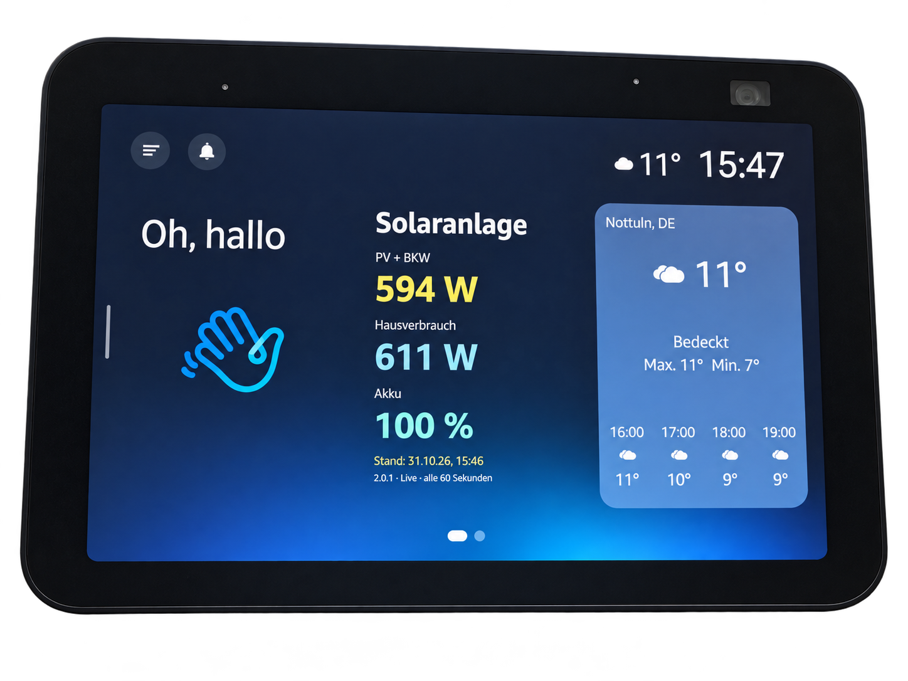
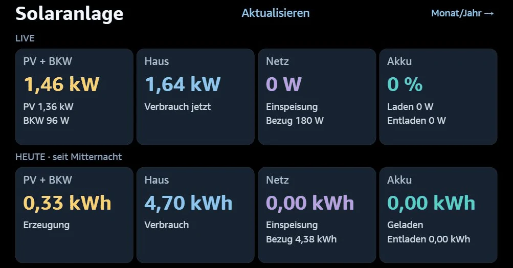
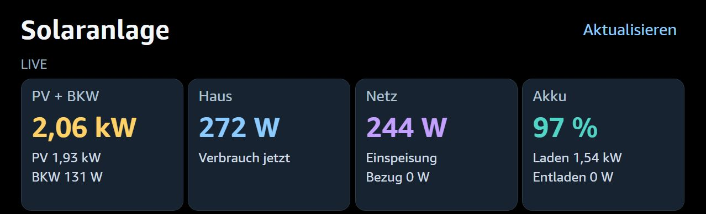
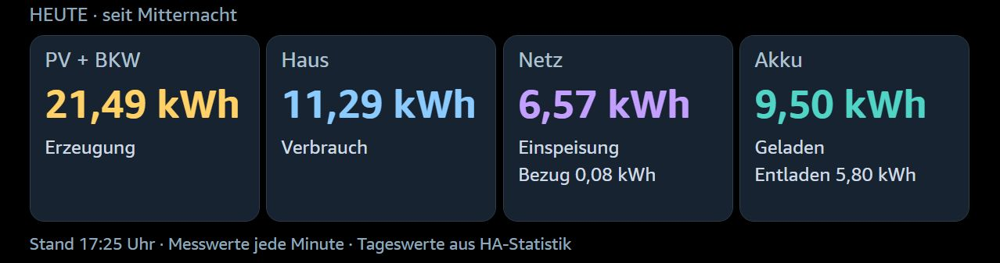
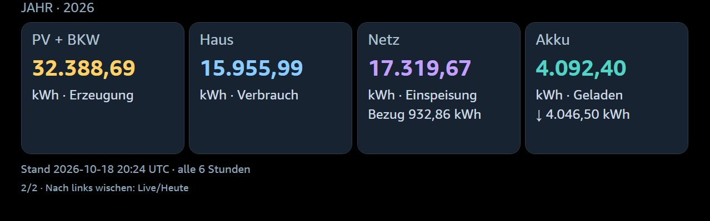

# Solaranlage auf dem Echo Show

> **Stand 18.11.2026:** Store **1.1.0 (Build 1811)** ist Live und verwendet Textwerte. Die kleine Store-Kachel bleibt ohne Messwerte; DEV 1811 und Vollbild funktionieren. [Aktueller Projektstatus](docs/ALEXA-STATUS.md) · [Fehler #20](https://github.com/kulmi84/solaranlage-echo-show/issues/20).

**HACS 1.0.15 · Bildwidget 2.0.1**

Solar-, Verbrauchs-, Akku- und Energiewerte aus Home Assistant auf dem Echo Show: als Vollbildansicht und Alexa+-kompatibles Widget. Sprachansagen funktionieren auch auf Alexa-Geräten ohne Display.

- Live- und Tageswerte sowie Monats- und Jahresübersichten.
- Automatische Aktualisierung mit sichtbarem Datenstand.
- Sensorauswahl und einmalige Kontoverknüpfung.
- Sprachabfragen, etwa: „Alexa, frage meine Solaranlage nach dem Akkustand.“

## Kleines Widget

Solarleistung, Hausverbrauch und Akkustand direkt auf dem Startbildschirm. Der bisherige Bildsatz bleibt stehen, bis der neue vollständig geladen ist.

## Vollbildansicht

PV und BKW, Hausverbrauch, Netz und Akku sowie Tageswerte im Ãœberblick.

### Livewerte

Die aktuellen Leistungswerte und der Akkustand auf einen Blick.

### Tageswerte

Erzeugung, Verbrauch sowie Netz- und Akkuenergie seit Mitternacht.

### Monat und Jahr

Energieübersichten für den laufenden Monat und das Jahr auf der zweiten Seite.

Die Abbildungen zeigen Momentaufnahmen. Das kleine Widget ist ein Gerätefoto; die Vollbildansichten sind Bildschirmaufnahmen.

## Einrichtung und Informationen

[In HACS hinzufügen](https://my.home-assistant.io/redirect/hacs_repository/?owner=kulmi84&repository=solaranlage-echo-show&category=integration) · [Einrichtung](docs/HACS.md) · [Bebilderte Anleitung](docs/ANLEITUNG.md)

HACS installiert die Home-Assistant-Integration. Alexa-Skill und Widget werden separat bereitgestellt. Den aktuellen Stand und die noch offenen Schritte findest du im [Projektstatus](docs/ALEXA-STATUS.md).

[Ausführlicher Änderungsverlauf](CHANGELOG.md) · [Eigene Infrastruktur](docs/EINFACH-EINRICHTEN.md) · [Datenschutz](https://solaranlage-kontodienst.kulmi84.workers.dev/privacy) · [Lizenz](LICENSE)

## Aktueller Development-Test

[DEV 1.1.0: native Textwerte und Vollbild per Tipp](docs/DEV-TEXTWERTE-1.1.0.md). Separater Teststand; keine Änderung der Store-Veröffentlichung.
